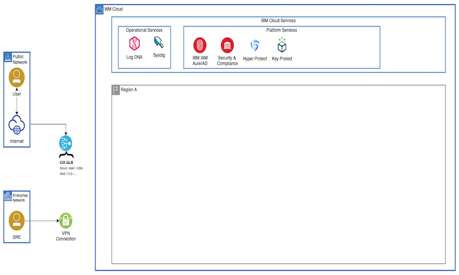

# IBM Cloud Reference Architecture

This reference architecture is a package of modular Terraform automation that can be configured and run in an IBM Cloud account. Read the instructions before configuring a schematics workspace.

## SZR Common Services

Single Region Common Services with IAM and Hyperprotect

The following diagram gives an overview of the IBM Cloud architecture topology and the components that will be configured by the Terraform automation.



## Prepare Git Repo

The following steps will guide you through the creation of a Schematics Workspace in IBM Cloud, before you get started please read the important comment below about IBM Cloud API keys.

> #### Sensitive variable values
>
> - NEVER save API keys in `variables.tf` file
> - NEVER push any API keys or senstive data to a git repository
>
>  *Use Terraform Environment Variables if locally testing* Read more [here](https://www.terraform.io/docs/language/values/variables.html#environment-variables)

1. If you are reading the README.MD file then you have received a download package of terraform modules. Follow these instructions to provision this refernece archtiecture in IBM Cloud using the Schematics Terraform as a Service capability.

2. Using your favourite Git source code management capabilility either initialize a Git Repository to store this package of Terraform infrastructure as code
3. Once the repository is initialised navigate to the folder where this automation content has been unzipped.
4. Follow you git providers instructions for adding an existing folder to a git repository eg. `git init` etc.

3. Push the Terraform into your repository

```
git add .
git commit -m "initial release"
git push
```

4. Now you have the terraform modules in a Git repository we need to enable this within IBM Cloud Schematics
4. Create a Resource Group that will be associated with the Schematics workspace
5. Login into IBM Cloud account and navigate to Schematics from the Within the IBM Cloud Console create an IBM Cloud Schematics Workspace and select the Resource Group you created earlier.
6. Within the Settings view of the workspace add the URL to the Git Repository and add the Personal Access Token from your git account so Schematics has read access to the Git Repository.
7. Select `terraform_v0.13` version
8. Click **Save Template Information**

## Terraform Modules

For more documentation on the specific features of the terraform modules included in this reference architecture use the referenced links below

- [docs/ibm-container-platform.md](docs/ibm-container-platform.md)
- [docs/ibm-resource-group.md](docs/ibm-resource-group.md)
- [docs/ibm-access-group.md](docs/ibm-access-group.md)
- [docs/key-protect.md](docs/key-protect.md)
- [docs/ibm-mongodb.md](docs/ibm-mongodb.md)
- [docs/ibm-object-storage.md](docs/ibm-object-storage.md)
- [docs/ibm-vpc.md](docs/ibm-vpc.md)
- [docs/ibm-activity-tracker.md](docs/ibm-activity-tracker.md)
- [docs/logdna.md](docs/logdna.md)
- [docs/sysdig.md](docs/sysdig.md)


The complete module catalog can be found here [Terraform Module Catalog](https://github.com/cloud-native-toolkit/garage-terraform-modules/blob/main/MODULES.md)


## Summary

For more information on IBM Cloud , IBM Schematics and Reference Architectures please reference these links below :


- [IBM Cloud Documentations](https://cloud.ibm.com/docs)
- [IBM Cloud Schematics CLI](https://cloud.ibm.com/docs/schematics?topic=schematics-schematics-cli-reference)

